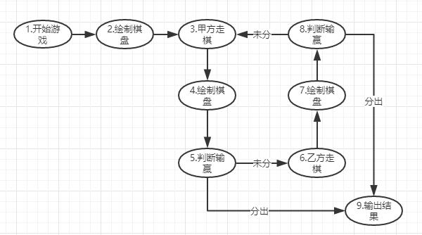
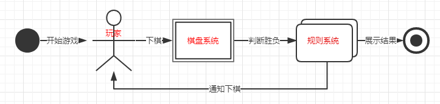

# 面向对象和面向过程
## 面向过程
面向过程就是分析出解决问题所需要的步骤，然后把这些步骤用函数一一实现，最后依次调用就完成了。

比如要开发一个中国象棋游戏, 用面向过程的方式分析步骤:
1.开始游戏，2.绘制棋盘，3.甲方走棋，4.绘制棋盘，5.判断输赢，6.乙方走棋，7.绘制棋盘，8.判断输赢，重复3-8直到9.输出结果，如下图示：

把上面各个步骤用函数一一实现，并按照顺序调用，完成整个中国象棋游戏，就是面向过程的实现。

## 面向对象
面向对象就是把构成问题事务分解成各个对象，然后分析对象的属性和行为，通过对象之间的消息传递来构造系统，解决问题。

同样的中国象棋游戏，用面向对象的方式分析：我们的对象有三类：1.玩家，他们有同样的行为-下象棋； 2.棋盘系统，负责绘制棋盘；3.规则系统，负责判定输赢、输出结果。玩家对象负责接收用户指令，并告知棋盘系统棋盘布局的变化，棋盘系统根据消息在屏幕上画出变化，同时用规则系统判断输赢，通知用户下棋，最后输出结果。如下图示：

## 面向对象和面向过程的区别
- 面向对象以功能划分对象来解决问题；面向过程以步骤的方式来解决问题。
- 面向对象优点：更符合人类思维，更简单，耦合性低，易维护、易复用、易扩展；缺点：性能较面向过程低。
- 面向过程优点：性能较面向对象高；缺点：没有面向对象易维护、易复用、易扩展。